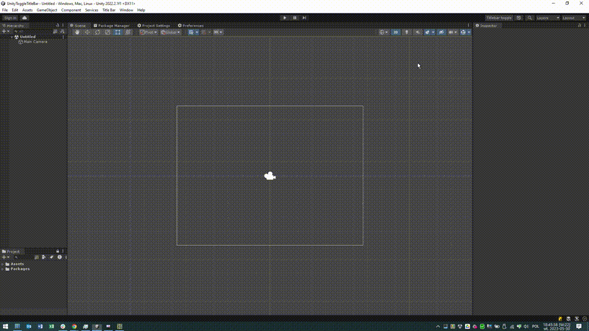

# UnityToggleTitleBar
A simple editor script that maximizes Unity's window area by hiding title bar and menu (Windows only)

# Installation
Just paste this repo's GIT url into Unity's package manager (PLUS SIGN, add package from GIT URL)

# Usage
Press F11 or button left of Undo History to toggle the title bar and menu.

# Dependencies
https://github.com/marijnz/unity-toolbar-extender

# License
MIT with additional condition that you can't use this for anything concerning military.

